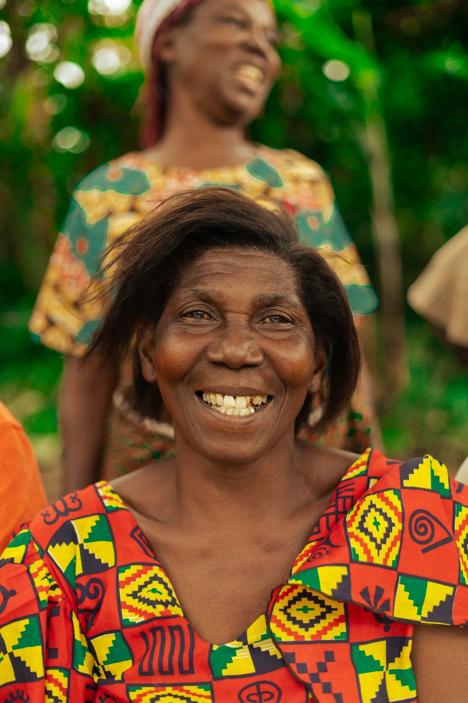
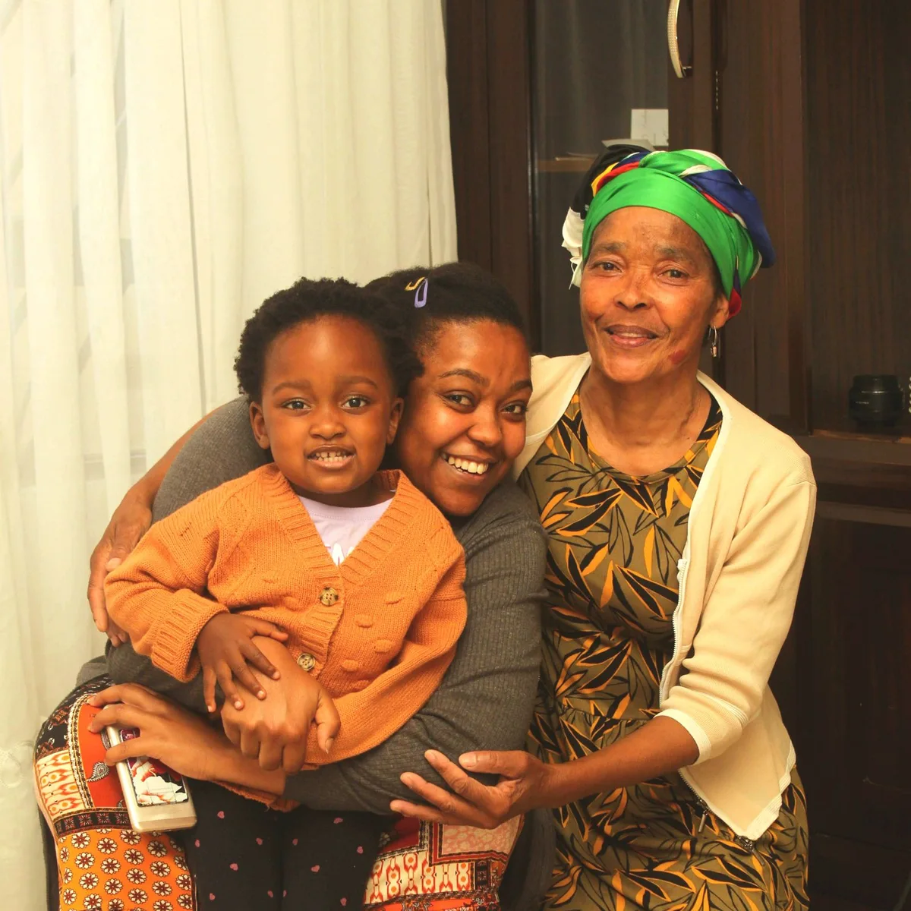

# Catalogue photographique du Hero

Quatre photographies, choisies pour les sourires et le lien humain que raconte
Zoumani : famille, générations, colis et proximité malgré la distance.
Le slogan, les téléchargements, les corridors, le téléphone et la carte de
trajet du Hero restent en place.

Les photos sont proposées sous la [licence Pexels](https://www.pexels.com/license/),
qui permet leur emploi sur un site commercial et leur recadrage. Les sources,
les auteurs, les exports et les tailles sont conservés dans
[`CREDITS.md`](../public/images/hero/CREDITS.md). Les personnes ne sont pas
présentées comme des clientes de Zoumani ou comme lui apportant une recommandation.

## 1. Un sourire qui accueille

Photographie actuelle conservée en première position. Auteur : hashtag-melvin.
[Source Pexels](https://www.pexels.com/photo/36039096/).

## 2. Le lien entre générations

La tendresse et le partage entre générations. Auteur : macd.
[Source Pexels](https://www.pexels.com/photo/38405256/).

## 3. Le plaisir d’ouvrir un colis

Un geste simple qui relie directement la photo à l’envoi d’un colis.
Auteur : Mikhail Nilov. [Source Pexels](https://www.pexels.com/photo/6969689/).

## 4. Un moment partagé à distance

Un sourire partagé autour d’un téléphone, en écho à la proximité malgré la
distance. Auteur : Askar Abayev. [Source Pexels](https://www.pexels.com/photo/6193635/).

## Intégration

- Première photo rendue dans le HTML, avec priorité haute, même sans JavaScript.
- Rotation toutes les 5 secondes ; fondu d’opacité de 700 ms, sans déplacement du cadre.
- Un bouton de 44 px permet de mettre en pause et de reprendre, en FR/EN.
- Pas de rotation en mouvement réduit, hors du Hero ou dans un onglet masqué.
- Photo suivante chargée après la première et avant son affichage. Une photo
  non chargée ne remplace pas celle déjà visible.
- Fichiers locaux optimisés avec `next/image` ; aucun appel à Pexels depuis la page.
- Aucun nouveau package, aucune modification du tracking ou de la charte.

La liste et le délai se règlent dans `src/features/home/model/hero-photos.ts`.
`HeroPortrait` porte seulement les images, le bouton et les temporisateurs ;
les textes et les actions du Hero conservent leur assemblage actuel.

## Validation

Le 6 octobre 2026 : typecheck et build de production réussis, 67 tests unitaires
et 16 tests navigateur réussis. Le lint ne signale que l’avertissement déjà
présent dans `src/app/error.tsx`.

Les tests couvrent le délai de cinq secondes, la pause, la boucle des quatre
photos, le mouvement réduit et le maintien de la photo courante si la suivante
ne charge pas. Les captures à 390 et 1440 px confirment des cadrages stables,
sans débordement horizontal ni erreur JavaScript. Les tests existants du
slogan, des téléchargements et des corridors restent valides.
